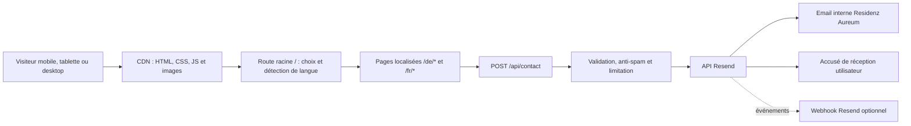

# STI — Spécifications techniques d’implémentation

> Architecture planifiée du nouveau site Residenz Aureum en HTML, CSS et JavaScript modernes, avec génération statique multilingue et envoi d’emails via Resend.

## Vue d’ensemble

| Domaine | Décision proposée |
| --- | --- |
| État | Planifié, non implémenté |
| Rendu | Pages HTML statiques pré-générées |
| Navigation | Multi-page, pas de SPA |
| Styles | CSS natif moderne, mobile-first |
| Interactions | JavaScript ES modules, progressive enhancement |
| Build | Node.js LTS + Vite ou pipeline statique équivalent |
| API | Fonction serverless Node.js pour les formulaires |
| Email | SDK Resend côté serveur uniquement |
| Langues | URL distinctes `/de/` et `/fr/` |
| Design de référence | Quiet Luxury V1, défini dans [DESIGN.md](DESIGN.md) |
| Hébergement | Statique sur CDN + fonctions serverless, fournisseur à confirmer |

## 1. Principes d’architecture

1. Le contenu SEO critique est présent dans le HTML initial.
2. Aucun framework client lourd n’est nécessaire.
3. JavaScript améliore l’expérience mais ne porte pas le contenu principal.
4. Les traductions sont injectées au build, jamais chargées après coup pour afficher la page.
5. La clé Resend ne quitte jamais l’environnement serveur.
6. Les pages allemandes et françaises partagent les composants, pas le DOM.
7. Les animations utilisent d’abord CSS, puis les Web Animations API lorsque nécessaire.
8. Chaque fonctionnalité possède un fallback sans animation ou sans JavaScript.

## 2. Contexte système



## 3. Organisation proposée du projet

```text
/
├─ public/
│  ├─ fonts/
│  ├─ images/
│  ├─ icons/
│  ├─ favicon.svg
│  └─ manifest.webmanifest
├─ src/
│  ├─ content/
│  │  ├─ de/
│  │  └─ fr/
│  ├─ data/
│  │  ├─ routes.json
│  │  ├─ navigation.json
│  │  └─ organization.json
│  ├─ templates/
│  │  ├─ layouts/
│  │  ├─ pages/
│  │  └─ partials/
│  ├─ styles/
│  │  ├─ tokens.css
│  │  ├─ reset.css
│  │  ├─ base.css
│  │  ├─ layout.css
│  │  ├─ components.css
│  │  ├─ utilities.css
│  │  └─ motion.css
│  └─ scripts/
│     ├─ main.js
│     ├─ language.js
│     ├─ navigation.js
│     ├─ forms.js
│     ├─ motion.js
│     ├─ gallery.js
│     └─ faq.js
├─ api/
│  ├─ contact.js
│  └─ resend-webhook.js
├─ scripts/
│  ├─ build-pages.mjs
│  ├─ build-sitemap.mjs
│  └─ validate-content.mjs
├─ tests/
│  ├─ unit/
│  ├─ integration/
│  ├─ e2e/
│  └─ visual/
├─ redirects.json
├─ package.json
└─ vite.config.js
```

> [!NOTE]
> Cette arborescence est la cible de mise en œuvre. Les noms de scripts devront être confirmés dans `package.json` lors de l’initialisation du code.

## 4. Pipeline de génération statique

### Entrées

- Templates HTML partagés.
- Contenus structurés par langue.
- Manifest de routes reliant chaque URL allemande à son équivalent français.
- Données d’organisation uniques et validées.
- Métadonnées SEO propres à chaque page.

### Sorties

```text
dist/
├─ index.html
├─ de/
│  ├─ index.html
│  ├─ ueber-uns/index.html
│  └─ ...
├─ fr/
│  ├─ index.html
│  ├─ a-propos/index.html
│  └─ ...
├─ assets/
├─ sitemap.xml
└─ robots.txt
```

### Règles

- Générer un document HTML complet par URL.
- Échapper toutes les valeurs de contenu.
- Échouer le build si une traduction obligatoire manque.
- Échouer le build si une URL n’a pas d’équivalent linguistique déclaré.
- Générer automatiquement les liens canoniques et `hreflang`.
- Générer le sitemap depuis le même manifest de routes.
- Hasher les fichiers CSS et JS produits.

## 5. HTML

### Standard

- `<!doctype html>` et encodage UTF-8.
- HTML sémantique : `header`, `nav`, `main`, `section`, `article`, `aside`, `footer`.
- Un lien d’évitement vers le contenu principal.
- Un seul `h1` visible.
- Titres hiérarchiques sans saut arbitraire.
- Boutons pour les actions, liens pour les navigations.
- Images décoratives avec `alt=""`.
- Images informatives avec texte alternatif localisé.
- Formulaires associés à des `label`.

### Exemple de tête localisée

```html
<html lang="de">
  <head>
    <meta charset="utf-8">
    <meta name="viewport" content="width=device-width, initial-scale=1">
    <title>Seniorenresidenz in Mülheim an der Ruhr | Residenz Aureum</title>
    <meta
      name="description"
      content="Persönliches Wohnen, verlässliche Betreuung und stilvoller Komfort in der Residenz Aureum."
    >
    <link rel="canonical" href="https://residenz-aureum.com/de/">
    <link rel="alternate" hreflang="de" href="https://residenz-aureum.com/de/">
    <link rel="alternate" hreflang="fr" href="https://residenz-aureum.com/fr/">
    <link rel="alternate" hreflang="x-default" href="https://residenz-aureum.com/">
  </head>
</html>
```

## 6. CSS

### Fonctions modernes retenues

- Custom properties pour les tokens.
- `@layer` pour contrôler la cascade.
- Grid et Flexbox.
- `clamp()` pour la typographie et les espacements fluides.
- Container queries pour les composants.
- Logical properties pour une structure plus robuste.
- `aspect-ratio` pour stabiliser les médias.
- `content-visibility: auto` uniquement sur les sections hors écran testées.
- `prefers-reduced-motion` pour les alternatives sans mouvement.
- `prefers-contrast` en amélioration progressive.

### Ordre de cascade

```css
@layer reset, tokens, base, layout, components, utilities, overrides;
```

### Règles

- Aucun style essentiel dans un attribut `style`.
- Aucun `!important` hors utilitaire documenté ou règle d’accessibilité.
- Les composants ne dépendent pas d’un sélecteur de page profond.
- Les dimensions des images sont réservées pour éviter les décalages.
- Les breakpoints sont motivés par la mise en page, pas par un appareil précis.

## 7. JavaScript front-end

### Modules

| Module | Responsabilité |
| --- | --- |
| `main.js` | Initialisation contrôlée des modules |
| `language.js` | Détection racine, préférence et sélecteur |
| `navigation.js` | Menu mobile, focus et header |
| `forms.js` | Validation UX, envoi, états et annonces |
| `motion.js` | Révélations, transitions et réduction du mouvement |
| `gallery.js` | Galerie accessible et chargement différé |
| `faq.js` | Accordéons accessibles |

### Contraintes

- Modules natifs `type="module"`.
- Aucun contenu essentiel généré uniquement côté client.
- Aucun scroll hijacking.
- Pas de dépendance critique à une API expérimentale.
- Les View Transitions peuvent améliorer les transitions si disponibles, avec fallback immédiat.
- Les événements sont délégués lorsque cela réduit le nombre de listeners.
- Les observers sont déconnectés après usage.

## 8. Détection de langue

### Algorithme

1. Exécuter uniquement sur `/`.
2. Vérifier une préférence explicite `ra-locale`.
3. Sinon lire `navigator.languages`, puis `navigator.language`.
4. Choisir `fr` si la première langue supportée commence par `fr`.
5. Choisir `de` pour toute autre valeur.
6. Utiliser `location.replace()` vers la page locale.
7. Conserver dans le HTML racine deux liens visibles et crawlables.

### Exemple de logique

```js
const supported = new Set(["de", "fr"]);
const saved = localStorage.getItem("ra-locale");
const languages = navigator.languages?.length
  ? navigator.languages
  : [navigator.language];

const detected = languages
  .map((value) => value.toLowerCase().split("-")[0])
  .find((value) => supported.has(value));

const locale = supported.has(saved) ? saved : detected ?? "de";
location.replace(`/${locale}/`);
```

### Choix manuel

- Enregistrer le choix uniquement après une action volontaire.
- Pointer vers l’URL équivalente définie au build.
- Ne jamais rediriger une page `/de/*` ou `/fr/*` en fonction du navigateur.
- Offrir un lien `DE` et `FR` dans le header et le footer.
- Mettre à jour l’attribut `aria-current` du choix actif.

## 9. SEO technique

### Métadonnées

Chaque page doit fournir :

- `<title>` unique.
- Meta description unique.
- Canonical absolue.
- `hreflang` réciproques.
- Open Graph localisé.
- `og:locale` et `og:locale:alternate`.
- URL d’image sociale réelle, sans texte incrusté obligatoire.

### Données structurées

JSON-LD généré au build :

- `Organization`.
- `LocalBusiness`.
- `MedicalOrganization` uniquement si le statut réel le permet.
- `BreadcrumbList` sur les pages internes.
- `WebSite` sur l’accueil.

Les propriétés doivent correspondre au contenu visible. Le balisage ne doit contenir ni avis, ni note, ni certification absente de la page.

### Sitemap

- XML encodé en UTF-8.
- URL absolues.
- Une URL canonique par page.
- Variantes linguistiques déclarées.
- Chemin recommandé : `/sitemap.xml`.
- Référence dans `/robots.txt`.

### Migration

`redirects.json` doit recenser :

- Ancienne URL.
- Nouvelle URL allemande.
- Statut `301`.
- Équivalent français éventuel.
- État de validation.

Éviter les chaînes de redirections et rediriger directement vers la destination finale.

## 10. Images et médias

### Pipeline

- Source originale conservée hors répertoire public.
- Génération AVIF et WebP.
- JPEG de secours seulement si nécessaire.
- Plusieurs largeurs : 480, 768, 1 024, 1 440 et 1 920 px selon l’usage.
- `srcset` et `sizes`.
- Dimensions `width` et `height` présentes.
- `loading="lazy"` hors image LCP.
- `fetchpriority="high"` réservé à l’image hero LCP.
- Une seule image LCP préchargée.

### Direction qualité

- Utiliser en priorité des photographies réelles.
- Ne pas représenter un autre établissement comme Residenz Aureum.
- Conserver les métadonnées de droits dans la source interne, pas nécessairement dans l’image publique.
- Prévoir un point focal par image pour les recadrages.

## 11. Animations

### Technologies

- CSS transitions pour hover, focus et micro-interactions.
- Intersection Observer pour les révélations.
- Web Animations API pour les séquences contrôlées.
- View Transitions API en amélioration progressive.

### Budget de mouvement

| Type | Durée | Amplitude maximale |
| --- | --- | --- |
| Hover/focus | 120–180 ms | 2 px ou 1,01× |
| Apparition de contenu | 420–700 ms | Translation 24 px |
| Transition de média | 600–900 ms | Échelle 1,02× |
| Stagger | 60–100 ms | 4 éléments maximum |

### Règles

- Aucune animation infinie décorative.
- Aucun parallaxe fort.
- Aucun mouvement qui bloque une interaction.
- Aucun délai avant l’accès au contenu.
- En mode réduit : opacity simple ou aucune animation.

```css
@media (prefers-reduced-motion: reduce) {
  *,
  *::before,
  *::after {
    scroll-behavior: auto;
    animation-duration: 0.01ms;
    animation-iteration-count: 1;
    transition-duration: 0.01ms;
  }
}
```

## 12. Formulaire de contact

### Endpoint

`POST /api/contact`

Un endpoint unique reçoit les modes `general` et `visit`.

### Requête

```json
{
  "submissionId": "uuid",
  "locale": "de",
  "intent": "visit",
  "firstName": "Anna",
  "lastName": "Beispiel",
  "email": "anna@example.com",
  "phone": "+49 000 000000",
  "preferredContact": "email",
  "preferredDate": "2026-09-15",
  "message": "Ich möchte einen Besichtigungstermin vereinbaren.",
  "privacyAccepted": true,
  "company": "",
  "formStartedAt": 1780000000000
}
```

`company` est un honeypot et doit rester vide.

### Réponses

| Statut | Sens | Corps minimal |
| --- | --- | --- |
| `202` | Demande acceptée et transmise à Resend | `{ "ok": true }` |
| `400` | JSON ou requête invalide | `{ "ok": false, "code": "BAD_REQUEST" }` |
| `422` | Champs invalides | `{ "ok": false, "code": "VALIDATION_ERROR", "fields": {} }` |
| `429` | Trop de tentatives | `{ "ok": false, "code": "RATE_LIMITED" }` |
| `503` | Service email indisponible | `{ "ok": false, "code": "EMAIL_UNAVAILABLE" }` |

Ne pas exposer les détails Resend, la clé, le destinataire interne ou une stack trace.

## 13. Validation serveur

### Allowlist

- `locale`: `de | fr`.
- `intent`: `general | visit`.
- `preferredContact`: `email | phone | none`.

### Limites

| Champ | Limite |
| --- | --- |
| `firstName`, `lastName` | 1–80 caractères |
| `email` | 254 caractères |
| `phone` | 30 caractères |
| `message` | 20–3 000 caractères |
| Corps JSON | 32 Ko maximum |

### Règles complémentaires

- Normaliser les espaces.
- Rejeter les caractères de contrôle.
- Échapper toutes les données injectées dans le HTML d’email.
- Générer aussi une version texte brut.
- Ne pas accepter de pièce jointe.
- Rejeter une date passée.
- Vérifier `Origin`, `Referer` et `Sec-Fetch-Site`.
- Rejeter les requêtes cross-site non autorisées.
- Appliquer une limitation persistante par combinaison IP hachée + email.
- Valeur initiale proposée : 5 requêtes par 15 minutes, à ajuster après observation.
- Activer une protection de type challenge uniquement si le spam le justifie.

## 14. Intégration Resend

### Pré-requis

1. Vérifier un domaine ou sous-domaine d’envoi.
2. Configurer SPF et DKIM.
3. Ajouter DMARC après validation de la politique d’envoi.
4. Créer une clé limitée à l’envoi.
5. Choisir une adresse capable de recevoir les réponses.

Sous-domaine recommandé :

```text
mail.residenz-aureum.com
```

Adresse proposée :

```text
Residenz Aureum <kontakt@mail.residenz-aureum.com>
```

La configuration finale doit être validée dans le compte Resend.

### Flux d’envoi

1. Valider et normaliser la charge.
2. Créer une référence de soumission.
3. Envoyer l’email interne.
4. Envoyer l’accusé de réception localisé.
5. Utiliser des clés d’idempotence distinctes :
   - `contact-internal/{submissionId}`
   - `contact-confirmation/{submissionId}`
6. Retourner `202` uniquement si les appels nécessaires ont été acceptés.

### Contenu email interne

- Type de demande.
- Langue.
- Identité et coordonnées.
- Date souhaitée si fournie.
- Message échappé.
- Horodatage UTC.
- Référence de soumission.
- `replyTo` positionné sur l’email du demandeur.

### Accusé de réception

- Sujet et corps dans la langue de la page.
- Confirmation sans promettre une date de réponse non validée.
- Coordonnées téléphoniques officielles.
- Rappel de ne pas transmettre de données médicales par email.
- Version HTML et texte.

### Webhooks — recommandé en phase 2

Événements utiles :

- `email.delivered`
- `email.bounced`
- `email.failed`
- `email.complained`

Le webhook doit :

- Lire le corps brut.
- Vérifier la signature avec le secret Resend/Svix.
- Dédupliquer avec `svix-id`.
- Répondre rapidement avec un code `200`.
- Ne jamais supposer que les événements arrivent dans l’ordre.

## 15. Variables d’environnement

| Variable | Requise | Usage |
| --- | --- | --- |
| `PUBLIC_SITE_URL` | Oui | URL canonique du site |
| `RESEND_API_KEY` | Oui | Authentification serveur Resend |
| `RESEND_FROM_EMAIL` | Oui | Expéditeur sur domaine vérifié |
| `RESEND_CONTACT_TO` | Oui | Destinataire interne |
| `CONTACT_ALLOWED_ORIGINS` | Oui | Origines autorisées, séparées par virgules |
| `RESEND_WEBHOOK_SECRET` | Non, phase 2 | Vérification des webhooks |

Règles :

- Aucun secret dans un fichier public ou préfixé comme variable client.
- Aucun secret commité.
- Clés distinctes par environnement.
- Rotation possible sans modifier le code.

## 16. Sécurité HTTP

### Headers

- `Content-Security-Policy`.
- `Strict-Transport-Security`.
- `X-Content-Type-Options: nosniff`.
- `Referrer-Policy: strict-origin-when-cross-origin`.
- `Permissions-Policy` restrictive.
- `Cross-Origin-Opener-Policy` si compatible avec les intégrations retenues.

### CSP initiale

```text
default-src 'self';
base-uri 'self';
form-action 'self';
frame-ancestors 'none';
img-src 'self' data:;
font-src 'self';
style-src 'self';
script-src 'self';
connect-src 'self';
```

La CSP doit être étendue seulement pour les services réellement ajoutés, par exemple une carte ou un outil de mesure.

## 17. Cache et CDN

| Ressource | Politique |
| --- | --- |
| HTML | Cache court, revalidation ou `stale-while-revalidate` |
| CSS/JS hashés | `public, max-age=31536000, immutable` |
| Images versionnées | Cache long |
| API contact | `no-store` |
| Sitemap/robots | Cache court |

## 18. Budgets de performance

| Ressource | Budget cible compressé |
| --- | --- |
| HTML initial | ≤ 60 Ko par page |
| CSS critique + global | ≤ 80 Ko |
| JavaScript initial | ≤ 100 Ko |
| Hero mobile | ≤ 250 Ko |
| Hero desktop | ≤ 450 Ko |
| Polices initiales | Deux fichiers WOFF2 maximum au premier rendu |

### Actions

- Auto-héberger les polices.
- Subsetter latin et latin étendu.
- Précharger uniquement les graisses critiques.
- Différer galerie, carte et scripts non essentiels.
- Réserver l’espace de tous les médias.
- Éviter les bibliothèques d’animation lourdes.

## 19. Responsive

### Plages de validation

- 320–479 px : mobile compact.
- 480–767 px : mobile large.
- 768–1 023 px : tablette portrait.
- 1 024–1 279 px : tablette paysage ou petit desktop.
- 1 280–1 599 px : desktop.
- 1 600–2 560 px : grand écran.

Les composants utilisent des container queries lorsque leur comportement dépend de leur largeur propre.

### Points critiques

- Header sans collision entre marque, langue et menu.
- H1 sans mot isolé ni débordement.
- CTA principal visible rapidement.
- Formulaires sur une colonne jusqu’à ce que deux colonnes restent confortables.
- Galerie avec ratio stable.
- Footer réorganisé en accordéons uniquement si les boutons restent accessibles.

## 20. Tests

### Unitaires

- Détection et mémorisation de langue.
- Mapping des routes DE/FR.
- Validation des champs.
- Génération des métadonnées.
- Échappement des emails.
- Génération des clés d’idempotence.

### Intégration

- Soumission valide DE et FR.
- Validation serveur indépendante du client.
- Erreurs Resend et timeout.
- Déduplication d’une soumission.
- Rate limiting.
- Requête cross-site rejetée.
- Signature webhook valide et invalide.

### End-to-end

- Navigation clavier.
- Menu mobile.
- Changement de langue sur une page interne.
- Formulaire général.
- Demande de visite.
- États de chargement, succès et erreur.
- Mode mouvement réduit.

### Visuel

- Snapshots aux largeurs 375, 768, 1 024, 1 440 et 1 920 px.
- Contrôle des deux langues.
- Textes longs français.
- Zoom navigateur à 200 %.

### SEO et qualité

- Lighthouse.
- Rich Results Test.
- Validation HTML.
- Crawl local.
- Liens cassés.
- Sitemap et `hreflang`.
- Axe ou outil équivalent pour l’accessibilité.

## 21. Déploiement

### Environnements

| Environnement | Usage |
| --- | --- |
| Local | Développement et tests |
| Preview | Revue design, contenu et recette |
| Production | Domaine public |

### Contrôles avant production

1. Build reproductible.
2. Aucun secret exposé.
3. Validation DE/FR.
4. Tests contact avec domaine Resend vérifié.
5. Redirections testées.
6. Headers de sécurité présents.
7. Lighthouse et tests d’accessibilité validés.
8. Sitemap accessible.
9. Sauvegarde de l’ancien site et plan de retour.

### Rollback

- Conserver la dernière version statique validée.
- Déployer par version immuable.
- Revenir à la version précédente sans reconstruire.
- Préserver les fonctions de contact compatibles avec la version précédente.

## 22. Risques et décisions ouvertes

| Risque | Impact | Réponse |
| --- | --- | --- |
| Hébergeur non choisi | Adaptateur serverless incertain | Garder l’API métier indépendante du fournisseur |
| Images réelles insuffisantes | Perte de crédibilité | Organiser une séance photo |
| Contenus médicaux non validés | Risque légal et SEO | Relecture par responsable compétent |
| Redirection de langue trop agressive | Indexation ou frustration | Limiter la détection à `/` |
| Spam formulaire | Charge et délivrabilité | Honeypot, rate limit, validation, challenge adaptatif |
| Email accepté mais non livré | Faux sentiment de succès | Webhooks et procédure de suivi |
| Animations trop lourdes | Mauvais Core Web Vitals | Budgets stricts et CSS natif |

## 23. Références

- [Google — Sites multilingues](https://developers.google.com/search/docs/specialty/international/managing-multi-regional-sites)
- [MDN — `Navigator.language`](https://developer.mozilla.org/en-US/docs/Web/API/Navigator/language)
- [Google — Construire un sitemap](https://developers.google.com/search/docs/crawling-indexing/sitemaps/build-sitemap)
- [Google — Données structurées LocalBusiness](https://developers.google.com/search/docs/appearance/structured-data/local-business)
- [Resend — Envoyer un email](https://resend.com/docs/api-reference/emails/send-email)
- [Resend — Gestion des domaines](https://resend.com/docs/dashboard/domains/introduction)
- [Resend — Clés d’idempotence](https://resend.com/docs/dashboard/emails/idempotency-keys)
- [Resend — Vérifier les webhooks](https://resend.com/docs/webhooks/verify-webhooks-requests)
- [OWASP — Validation des entrées](https://cheatsheetseries.owasp.org/cheatsheets/Input_Validation_Cheat_Sheet.html)
- [OWASP — Prévention CSRF](https://cheatsheetseries.owasp.org/cheatsheets/Cross-Site_Request_Forgery_Prevention_Cheat_Sheet.html)
- [MDN — `prefers-reduced-motion`](https://developer.mozilla.org/en-US/docs/Web/CSS/Reference/At-rules/%40media/prefers-reduced-motion)

## Documents associés

- [PRD](PRD.md)
- [Système de design](DESIGN.md)
